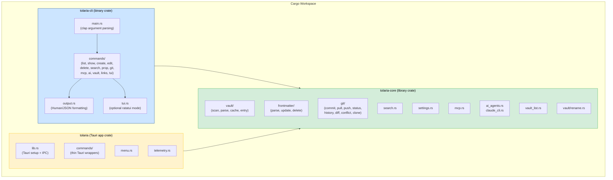

# Design Document: Linux Console App

## Overview

This design describes how to convert Tolaria from a Tauri v2 + React desktop GUI into a dual-target project that also produces a standalone Linux console/CLI binary. The Rust backend is already well-separated: the `commands/` layer is a thin wrapper that delegates to pure domain modules (`vault/`, `git/`, `frontmatter/`, `search.rs`, `settings.rs`, `mcp.rs`, `ai_agents.rs`, `claude_cli.rs`, `vault_list.rs`). The strategy is to extract these domain modules into a `tolaria-core` library crate, then build a new `tolaria-cli` binary crate on top of it.

The CLI uses `clap` for argument parsing, supports both human-readable and JSON output, and shares the same vault cache, frontmatter editing logic, and git operations as the GUI. An optional TUI mode uses `ratatui` for interactive browsing.

### Design Decisions

1. **Workspace-based Cargo layout**: Move from a single `src-tauri` crate to a Cargo workspace with three members: `tolaria-core` (library), `tolaria-cli` (binary), and the existing `tolaria` Tauri app crate. This keeps the GUI build unchanged while enabling the CLI.

2. **Core library boundary**: Everything below the `commands/` layer moves into `tolaria-core`. The `commands/` layer, `lib.rs` (Tauri setup), `main.rs`, `menu.rs`, `app_updater.rs`, and `telemetry.rs` stay in the Tauri crate. The `VaultBoundary` abstraction moves to core but without the `vault_list`-based active vault lookup (that becomes a consumer concern).

3. **clap for CLI parsing**: `clap` with derive macros provides subcommand routing, help generation, shell completions, and argument validation. This is the standard choice for Rust CLI tools.

4. **Output strategy**: A shared `OutputFormat` enum (`Human` | `Json`) threads through all commands. Human output uses `comfy-table` for tabular data and `termcolor` for TTY-aware coloring. JSON output serializes directly from the existing `serde::Serialize` types.

5. **Static linking via musl**: Linux binaries target `x86_64-unknown-linux-musl` and `aarch64-unknown-linux-musl` for fully static, zero-dependency binaries.

## Architecture



### Module Migration Map

| Current location | Destination | Notes |
|---|---|---|
| `src-tauri/src/vault/` | `tolaria-core/src/vault/` | All files move as-is |
| `src-tauri/src/frontmatter/` | `tolaria-core/src/frontmatter/` | All files move as-is |
| `src-tauri/src/git/` | `tolaria-core/src/git/` | All files move as-is |
| `src-tauri/src/search.rs` | `tolaria-core/src/search.rs` | Remove `crate::vault` ref → use `tolaria_core::vault` |
| `src-tauri/src/settings.rs` | `tolaria-core/src/settings.rs` | Move as-is |
| `src-tauri/src/vault_list.rs` | `tolaria-core/src/vault_list.rs` | Move as-is |
| `src-tauri/src/mcp.rs` | `tolaria-core/src/mcp.rs` | Move as-is; `spawn_ws_bridge` stays |
| `src-tauri/src/ai_agents.rs` | `tolaria-core/src/ai_agents.rs` | Move as-is |
| `src-tauri/src/claude_cli.rs` | `tolaria-core/src/claude_cli.rs` | Move as-is |
| `src-tauri/src/commands/` | stays in `src-tauri/src/commands/` | Thin wrappers now import from `tolaria_core` |
| `src-tauri/src/commands/vault/boundary.rs` | `tolaria-core/src/boundary.rs` | Core path validation moves; Tauri-specific `from_request` stays |
| `src-tauri/src/lib.rs` | stays in `src-tauri/src/lib.rs` | Tauri setup, plugin registration |
| `src-tauri/src/menu.rs` | stays | Tauri-only |
| `src-tauri/src/app_updater.rs` | stays | Tauri-only |
| `src-tauri/src/telemetry.rs` | stays | Tauri-only |

### Workspace Layout

```
Cargo.toml                    # workspace root
├── crates/
│   └── tolaria-core/
│       ├── Cargo.toml
│       └── src/
│           ├── lib.rs
│           ├── vault/         # moved from src-tauri/src/vault/
│           ├── frontmatter/   # moved from src-tauri/src/frontmatter/
│           ├── git/           # moved from src-tauri/src/git/
│           ├── search.rs
│           ├── settings.rs
│           ├── vault_list.rs
│           ├── mcp.rs
│           ├── ai_agents.rs
│           ├── claude_cli.rs
│           └── boundary.rs
├── crates/
│   └── tolaria-cli/
│       ├── Cargo.toml
│       └── src/
│           ├── main.rs
│           ├── commands/
│           │   ├── mod.rs
│           │   ├── list.rs
│           │   ├── show.rs
│           │   ├── create.rs
│           │   ├── edit.rs
│           │   ├── delete.rs
│           │   ├── search.rs
│           │   ├── prop.rs
│           │   ├── git.rs
│           │   ├── mcp.rs
│           │   ├── ai.rs
│           │   ├── vault.rs
│           │   ├── links.rs
│           │   └── tui.rs
│           └── output.rs
└── src-tauri/                 # existing Tauri crate (now workspace member)
    ├── Cargo.toml             # depends on tolaria-core
    └── src/
        ├── main.rs
        ├── lib.rs
        ├── commands/          # thin Tauri wrappers, now importing tolaria_core::*
        ├── menu.rs
        ├── app_updater.rs
        └── telemetry.rs
```

## Components and Interfaces

### tolaria-core Public API

The core library exposes these module-level public functions. All are pure Rust with no Tauri dependency.

```rust
// --- vault ---
pub mod vault {
    pub fn scan_vault(vault_path: &Path) -> Result<Vec<VaultEntry>, String>;
    pub fn scan_vault_cached(vault_path: &Path) -> Result<Vec<VaultEntry>, String>;
    pub fn invalidate_cache(vault_path: &Path);
    pub fn reload_entry(path: &Path) -> Result<VaultEntry, String>;
    pub fn parse_md_file(path: &Path, git_dates: Option<(u64, u64)>) -> Result<VaultEntry, String>;
    pub fn scan_vault_folders(vault_path: &Path) -> Result<Vec<FolderNode>, String>;
    // rename operations
    pub fn rename_note(vault_path: &str, old_path: &str, new_title: &str, ...) -> RenameResult;
    pub fn rename_note_filename(vault_path: &str, old_path: &str, new_stem: &str) -> RenameResult;
    pub fn move_note_to_folder(vault_path: &str, old_path: &str, folder: &str) -> RenameResult;
    // title helpers
    pub fn derive_markdown_title_from_content(content: &str, filename: &str) -> String;
}

// --- frontmatter ---
pub mod frontmatter {
    pub fn update_frontmatter_content(content: &str, key: &str, value: Option<FrontmatterValue>) -> Result<String, String>;
    pub fn update_frontmatter(path: &str, key: &str, value: FrontmatterValue) -> Result<String, String>;
    pub fn delete_frontmatter_property(path: &str, key: &str) -> Result<String, String>;
    pub fn with_frontmatter<F>(path: &str, transform: F) -> Result<String, String>;
}

// --- git ---
pub mod git {
    pub fn get_file_history(vault_path: &str, path: &str) -> Result<Vec<GitCommit>, String>;
    pub fn get_modified_files(vault_path: &str) -> Result<Vec<ModifiedFile>, String>;
    pub fn get_file_diff(vault_path: &str, path: &str) -> Result<String, String>;
    pub fn git_commit(vault_path: &str, message: &str) -> Result<String, String>;
    pub fn git_pull(vault_path: &str) -> Result<GitPullResult, String>;
    pub fn git_push(vault_path: &str) -> Result<GitPushResult, String>;
    pub fn git_remote_status(vault_path: &str) -> Result<GitRemoteStatus, String>;
    pub fn get_conflict_files(vault_path: &str) -> Result<Vec<String>, String>;
    pub fn git_resolve_conflict(vault_path: &str, file: &str, strategy: &str) -> Result<(), String>;
    pub fn init_repo(path: &str) -> Result<(), String>;
    pub fn clone_repo(url: &str, local_path: &str) -> Result<String, String>;
}

// --- search ---
pub fn search_vault(vault_path: &str, query: &str, mode: &str, limit: usize) -> Result<SearchResponse, String>;

// --- settings ---
pub fn get_settings() -> Result<Settings, String>;
pub fn save_settings(settings: Settings) -> Result<(), String>;

// --- vault_list ---
pub fn load_vault_list() -> Result<VaultList, String>;
pub fn save_vault_list(list: &VaultList) -> Result<(), String>;

// --- mcp ---
pub fn spawn_ws_bridge(vault_path: &str) -> Result<Child, String>;
pub fn register_mcp(vault_path: &str) -> Result<String, String>;
pub fn remove_mcp() -> String;
pub fn check_mcp_status(vault_path: &str) -> McpStatus;

// --- ai_agents ---
pub fn get_ai_agents_status() -> AiAgentsStatus;
pub fn run_ai_agent_stream<F>(request: AiAgentStreamRequest, emit: F) -> Result<String, String>;

// --- boundary ---
pub mod boundary {
    pub fn validate_path_within_vault(vault_root: &Path, target: &Path) -> Result<(), String>;
    pub fn validate_relative_child_path(relative_path: &str) -> Result<(), String>;
}
```

### CLI Argument Structure (clap)

```rust
#[derive(Parser)]
#[command(name = "tolaria", about = "Tolaria vault management CLI")]
struct Cli {
    /// Path to the vault directory
    #[arg(long, global = true)]
    vault: Option<String>,

    /// Output as JSON
    #[arg(long, global = true)]
    json: bool,

    /// Suppress informational messages
    #[arg(long, global = true)]
    quiet: bool,

    #[command(subcommand)]
    command: Command,
}

#[derive(Subcommand)]
enum Command {
    /// List vault entries
    List {
        #[arg(long)] r#type: Option<String>,
        #[arg(long)] status: Option<String>,
        #[arg(long, default_value = "modified")] sort: String,
    },
    /// Show a note's content
    Show { note: String },
    /// Create a new note
    Create {
        title: String,
        #[arg(long)] r#type: Option<String>,
    },
    /// Open a note in $EDITOR
    Edit { note: String },
    /// Delete a note
    Delete {
        note: String,
        #[arg(long)] force: bool,
    },
    /// Search the vault
    Search {
        query: String,
        #[arg(long, default_value = "20")] limit: usize,
    },
    /// Manage frontmatter properties
    Prop {
        #[command(subcommand)] action: PropAction,
    },
    /// Git operations
    Git {
        #[command(subcommand)] action: GitAction,
    },
    /// MCP server management
    Mcp {
        #[command(subcommand)] action: McpAction,
    },
    /// AI agent operations
    Ai {
        #[command(subcommand)] action: AiAction,
    },
    /// Vault initialization and configuration
    Init { path: String },
    Clone { url: String, path: String },
    Vault {
        #[command(subcommand)] action: VaultAction,
    },
    Config {
        #[command(subcommand)] action: ConfigAction,
    },
    /// Wikilink operations
    Links { note: String },
    Backlinks { note: String },
    Relationships { note: String },
    /// Interactive TUI mode
    Tui,
}
```

### Output Formatting

```rust
pub enum OutputFormat {
    Human,
    Json,
}

pub struct OutputContext {
    pub format: OutputFormat,
    pub is_tty: bool,
    pub quiet: bool,
}

impl OutputContext {
    /// Print a table of vault entries (human) or JSON array (json)
    pub fn print_entries(&self, entries: &[VaultEntry]);
    /// Print a single entry detail view
    pub fn print_entry_detail(&self, entry: &VaultEntry, content: &str);
    /// Print search results
    pub fn print_search_results(&self, response: &SearchResponse);
    /// Print git status
    pub fn print_modified_files(&self, files: &[ModifiedFile]);
    /// Print an informational message (suppressed in quiet mode)
    pub fn info(&self, msg: &str);
    /// Print an error to stderr
    pub fn error(&self, msg: &str);
}
```

### Note Resolution

The CLI resolves note references using the same multi-pass logic as the GUI. Given a user-provided string, resolution tries:

1. Exact filename stem match (e.g., `my-project` → `my-project.md`)
2. Alias match (from frontmatter `aliases:`)
3. Exact title match
4. Humanized title match (kebab-case → words)
5. Last segment of path-style references (e.g., `person/alice` → `alice`)

```rust
/// Resolve a user-provided note reference to a VaultEntry.
pub fn resolve_note<'a>(entries: &'a [VaultEntry], reference: &str) -> Option<&'a VaultEntry>;
```

### Vault Path Resolution

The CLI determines the active vault through this priority chain:

1. `--vault <path>` command-line argument (highest priority)
2. `active_vault` from `~/.config/com.tolaria.app/vaults.json`
3. Error with usage instructions if neither is available

## Data Models

All data models are defined in `tolaria-core` and shared between GUI and CLI. No new data models are introduced — the CLI reuses the existing types.

### Existing Types (preserved as-is)

| Type | Module | Description |
|---|---|---|
| `VaultEntry` | `vault/entry.rs` | Core note representation with all fields |
| `FolderNode` | `vault/entry.rs` | Vault folder tree node |
| `FrontmatterValue` | `frontmatter/yaml.rs` | Enum: String, Number, Bool, List, Null |
| `GitCommit` | `git/mod.rs` | Commit metadata |
| `ModifiedFile` | `git/status.rs` | File change status |
| `GitRemoteStatus` | `git/remote.rs` | Branch, ahead/behind, hasRemote |
| `GitPullResult` | `git/remote.rs` | Pull operation result |
| `GitPushResult` | `git/remote.rs` | Push operation result |
| `PulseCommit` | `git/pulse.rs` | Activity feed commit |
| `SearchResult` | `search.rs` | Search hit with score and snippet |
| `SearchResponse` | `search.rs` | Search results with metadata |
| `Settings` | `settings.rs` | App settings |
| `VaultList` / `VaultEntry` (list) | `vault_list.rs` | Registered vaults |
| `McpStatus` | `mcp.rs` | MCP server status enum |
| `AiAgentsStatus` | `ai_agents.rs` | Agent availability |
| `AiAgentStreamEvent` | `ai_agents.rs` | Streaming event enum |
| `RenameResult` | `vault/rename.rs` | Note rename outcome |

### New Types (CLI-only)

```rust
/// CLI output format selection
pub enum OutputFormat { Human, Json }

/// Resolved vault context for CLI operations
pub struct CliContext {
    pub vault_path: String,
    pub output: OutputContext,
}
```


## Correctness Properties

*A property is a characteristic or behavior that should hold true across all valid executions of a system — essentially, a formal statement about what the system should do. Properties serve as the bridge between human-readable specifications and machine-verifiable correctness guarantees.*

### Property 1: VaultEntry Serialization Round-Trip

*For any* valid `VaultEntry` instance, serializing it to JSON and deserializing it back should produce an equivalent `VaultEntry` with all fields preserved.

**Validates: Requirements 1.9**

### Property 2: Vault Boundary Enforcement

*For any* vault root path and any candidate file path, the boundary validator should accept the path if and only if the candidate's canonical path is a descendant of the vault root's canonical path. Paths containing `..` traversals, symlinks escaping the vault, or absolute paths outside the root should be rejected.

**Validates: Requirements 1.10, 5.6**

### Property 3: Vault Path Resolution Priority

*For any* combination of CLI `--vault` argument (present or absent) and `active_vault` in the vault list config (present or absent), the resolved vault path should follow the priority chain: CLI argument > config active_vault > error. When both are present, the CLI argument wins.

**Validates: Requirements 2.3**

### Property 4: List Filtering Correctness

*For any* set of vault entries and any type or status filter value, the filtered list should contain exactly the entries matching the filter predicate — no matching entries excluded, no non-matching entries included.

**Validates: Requirements 3.2, 3.3**

### Property 5: List Sorting Correctness

*For any* set of vault entries and any valid sort field (title, modified, created, type), the sorted output should be ordered according to the specified field and direction.

**Validates: Requirements 3.4**

### Property 6: Note Creation Produces Valid File

*For any* valid title string and optional type string, creating a note should produce a markdown file at the vault root where: the file contains the title as an H1 heading, and if a type was specified, the frontmatter contains a `type:` field with the specified value.

**Validates: Requirements 3.6, 3.7**

### Property 7: Note Resolution Multi-Pass

*For any* vault entry, resolving by its filename stem, by any of its aliases, or by its exact title should all return the same entry. Resolution should be deterministic and consistent across all valid reference forms.

**Validates: Requirements 3.11**

### Property 8: Search Results Ordering and Limit

*For any* search query, vault, and limit value, the returned results should be sorted by relevance score in descending order, and the result count should be at most the specified limit.

**Validates: Requirements 4.1, 4.3**

### Property 9: Frontmatter Property Set/Get Round-Trip

*For any* note and any valid frontmatter key-value pair, setting the property and then reading it back should return the same value. The round-trip should preserve the value through the line-by-line YAML editing pipeline.

**Validates: Requirements 5.1, 5.2**

### Property 10: Frontmatter Property Deletion

*For any* note that contains a given frontmatter property, deleting that property should result in the property being absent from the file, while all other properties remain unchanged.

**Validates: Requirements 5.3**

### Property 11: Output Completeness

*For any* domain object (VaultEntry, SearchResult, GitCommit, ModifiedFile, GitRemoteStatus, VaultList entry), the human-readable formatter should include all required display fields as specified in the requirements (e.g., title, type, status, modified date for list entries; hash, message, author, date for commits).

**Validates: Requirements 3.1, 4.2, 6.1, 6.6, 6.9, 9.3**

### Property 12: JSON Output Validity

*For any* CLI operation invoked with the `--json` flag, the stdout output should be valid JSON that can be parsed without error.

**Validates: Requirements 10.1**

### Property 13: Non-TTY Output Has No ANSI Codes

*For any* CLI output produced when stdout is not a TTY (piped), the output should contain no ANSI escape sequences.

**Validates: Requirements 10.3**

### Property 14: Quiet Mode Suppresses Informational Messages

*For any* CLI operation invoked with the `--quiet` flag, the stdout output should contain only the primary result data — no informational or status messages.

**Validates: Requirements 10.5**

### Property 15: Outgoing Wikilinks Completeness

*For any* note containing `[[wikilink]]` patterns in its body, the `links` command output should list every wikilink target extracted from the body, matching the same extraction logic used by the GUI.

**Validates: Requirements 12.1**

### Property 16: Backlinks Completeness

*For any* note in a vault, the `backlinks` command should return exactly the set of notes whose body or frontmatter contains a `[[wikilink]]` referencing the target note — no false positives, no missed references.

**Validates: Requirements 12.2**

### Property 17: Wikilink Update on Rename

*For any* vault containing cross-referenced notes, renaming a note should update all `[[wikilink]]` references across the vault that pointed to the old name, so that they now point to the new name. No other wikilinks should be modified.

**Validates: Requirements 12.4**

## Error Handling

### Error Categories

| Category | Behavior | Exit Code |
|---|---|---|
| Vault not found | Print error to stderr with path and suggestion | 1 |
| Note not found | Print "Note not found: {reference}" to stderr | 1 |
| Note resolution ambiguous | Print all matching candidates to stderr | 1 |
| Path outside vault boundary | Print boundary violation error to stderr | 1 |
| Git operation failure | Print git stderr output to stderr | 1 |
| File I/O error | Print OS error message to stderr | 1 |
| Invalid arguments | clap prints usage help to stderr | 2 |
| MCP server spawn failure | Print Node.js detection failure details to stderr | 1 |
| AI agent not found | Print agent name and detection paths tried to stderr | 1 |
| Merge conflict detected | Print conflicted file list, suggest resolution commands | 1 |

### Error Output Format

- **Human mode**: Colored error prefix (`error:` in red when TTY), followed by the message
- **JSON mode**: `{ "error": "message" }` to stdout (so JSON consumers can parse it)
- **stderr**: Always receives the raw error message regardless of format

### Graceful Degradation

- If the vault cache is corrupt, fall back to full scan (existing behavior in `scan_vault_cached`)
- If `$EDITOR` is not set and `vim` is not found, print a helpful error suggesting `export EDITOR=...`
- If git is not installed, git subcommands print a clear error; non-git commands still work
- If Node.js is not found, MCP commands print a clear error; non-MCP commands still work

## Testing Strategy

### Dual Testing Approach

This feature uses both unit/integration tests and property-based tests for comprehensive coverage.

### Property-Based Tests

Property-based tests use the `proptest` crate (already a dev-dependency) with a minimum of 100 iterations per property. Each test is tagged with a comment referencing its design property.

```rust
// Feature: linux-console-app, Property 1: VaultEntry serialization round-trip
proptest! {
    #[test]
    fn vault_entry_roundtrip(entry in arb_vault_entry()) {
        let json = serde_json::to_string(&entry).unwrap();
        let decoded: VaultEntry = serde_json::from_str(&json).unwrap();
        prop_assert_eq!(entry, decoded);
    }
}
```

Properties to implement as PBT:
- Property 1: VaultEntry serialization round-trip
- Property 2: Vault boundary enforcement
- Property 3: Vault path resolution priority
- Property 4: List filtering correctness
- Property 5: List sorting correctness
- Property 6: Note creation produces valid file
- Property 7: Note resolution multi-pass
- Property 8: Search results ordering and limit
- Property 9: Frontmatter property set/get round-trip
- Property 10: Frontmatter property deletion
- Property 11: Output completeness
- Property 12: JSON output validity
- Property 13: Non-TTY output has no ANSI codes
- Property 14: Quiet mode suppresses info messages
- Property 15: Outgoing wikilinks completeness
- Property 16: Backlinks completeness
- Property 17: Wikilink update on rename

### Unit Tests

Unit tests cover specific examples and edge cases not suited for PBT:

- CLI argument parsing (clap derives handle this, but verify edge cases)
- `$EDITOR` fallback to `vim`
- Delete confirmation prompt behavior
- AI agent selection with `--agent` flag
- Vault init/clone integration
- MCP start/stop/status integration
- TUI keyboard navigation (manual + example tests)

### Integration Tests

Integration tests verify end-to-end behavior with real filesystems and git repos:

- Git operations (commit, pull, push, conflict resolution) against temp repos
- MCP server spawn and registration against temp config files
- Vault init creating correct directory structure
- Cache sharing between simulated GUI and CLI operations

### Test Organization

```
crates/tolaria-core/src/       # existing unit tests stay inline (#[cfg(test)])
crates/tolaria-core/tests/     # integration tests for core library
crates/tolaria-cli/src/        # unit tests inline
crates/tolaria-cli/tests/      # CLI integration tests (invoke binary, check output)
```

### CI Pipeline

```yaml
# Linux-specific CI job
- cargo test --workspace                    # all unit + integration tests
- cargo build --target x86_64-unknown-linux-musl -p tolaria-cli
- cargo build --target aarch64-unknown-linux-musl -p tolaria-cli
- file target/x86_64-unknown-linux-musl/release/tolaria  # verify static linking
```
