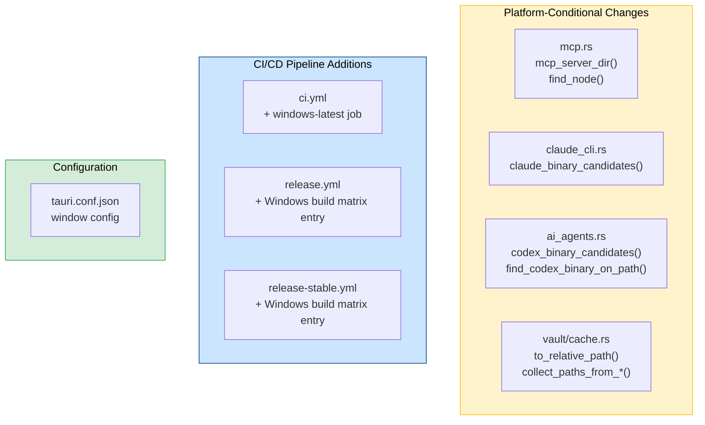

# Design Document: Windows Platform Support

## Overview

Tolaria is a Tauri v2 + React + Rust desktop app currently shipping macOS-only (Apple Silicon). The codebase is ~95% cross-platform. This design covers the remaining ~5% of platform-specific code paths, CI/CD pipeline additions, and build configuration needed to produce unsigned Windows `.msi`/`.exe` installers from the same codebase.

The changes fall into three categories:
1. **Rust backend**: Platform-conditional path resolution for MCP server, Node.js, and CLI agent binaries; path separator normalization in the cache/git subsystem
2. **CI/CD pipelines**: Adding `windows-latest` runner jobs to `ci.yml`, `release.yml`, and `release-stable.yml`
3. **Tauri configuration**: Ensuring window chrome and title bar work correctly on Windows

Windows code signing (Authenticode) is explicitly out of scope.

## Architecture

The existing architecture remains unchanged. All modifications are surgical — adding `#[cfg(target_os)]` branches to existing functions or adding parallel CI jobs. No new modules, crates, or React components are introduced.



## Components and Interfaces

### 1. MCP Server Path Resolution (`src-tauri/src/mcp.rs`)

**Current behavior**: `mcp_server_dir()` checks dev path via `CARGO_MANIFEST_DIR`, then navigates from the exe to `Contents/Resources/mcp-server/` (macOS `.app` bundle layout).

**Change**: Add a Windows release path. On Windows, Tauri places resources alongside the exe in a flat directory structure: `<exe_dir>/mcp-server/`.

```rust
pub(crate) fn mcp_server_dir() -> Result<PathBuf, String> {
    // 1. Dev mode (both platforms) — CARGO_MANIFEST_DIR
    // 2. macOS release — exe/../Resources/mcp-server/
    // 3. Windows release — exe_dir/mcp-server/
    // 4. Error with all checked paths
}
```

**Design decision**: Use `cfg!(target_os = "windows")` runtime check rather than `#[cfg()]` compile-time gates so the function stays testable from a single compilation unit. The candidate paths are tried in order; the first one containing `ws-bridge.js` wins.

### 2. Node Binary Discovery (`src-tauri/src/mcp.rs`)

**Current behavior**: `find_node()` runs `which node`, then checks Homebrew/nvm/Volta fallback paths.

**Change**: On Windows, use `where.exe node` instead of `which node`. Add Windows-specific fallback paths: `%ProgramFiles%\nodejs\node.exe`, `%LOCALAPPDATA%\Volta\node.exe`, `%APPDATA%\nvm\*\node.exe`.

```rust
fn find_node_on_path() -> Result<Option<PathBuf>, String> {
    let (cmd, arg) = if cfg!(target_os = "windows") {
        ("where.exe", "node")
    } else {
        ("which", "node")
    };
    // ...
}
```

### 3. CLI Agent Detection (`src-tauri/src/claude_cli.rs`, `src-tauri/src/ai_agents.rs`)

**Current behavior**: `claude_binary_candidates()` and `codex_binary_candidates()` return Unix paths. `find_claude_binary_on_path()` and `find_codex_binary_on_path()` use `which`.

**Changes**:
- Add Windows candidate paths with `.exe`/`.cmd` extensions
- Use `where.exe` instead of `which` on Windows
- Skip shell-based detection (`find_claude_binary_in_user_shell`) on Windows since `zsh`/`bash -lc` doesn't apply

Windows Claude Code candidates:
- `%LOCALAPPDATA%\Programs\claude\claude.exe`
- `%APPDATA%\npm\claude.cmd`
- `%USERPROFILE%\.claude\local\claude.exe`

Windows Codex candidates:
- `%APPDATA%\npm\codex.cmd`
- `%LOCALAPPDATA%\Programs\codex\codex.exe`

### 4. Cache Subsystem Path Handling (`src-tauri/src/vault/cache.rs`)

**Current behavior**: `to_relative_path()` strips the vault prefix using forward-slash comparison. `collect_paths_from_diff()` and `collect_paths_from_porcelain()` split on `/`. Git output parsing uses `.lines()`.

**Changes**:
- `to_relative_path()`: Normalize backslashes to forward slashes before comparison, so Windows git output (which may use either separator) matches correctly
- `has_hidden_segment()`: Split on both `/` and `\`
- Git output parsing: `.lines()` already handles CRLF (Rust's `str::lines()` strips `\r\n`), but add `.trim()` to individual path strings as a safety net

### 5. CI Pipeline — Windows Test Job (`.github/workflows/ci.yml`)

Add a `test-windows` job running on `windows-latest` that:
- Installs pnpm, Node.js 22, Rust stable
- Caches Rust deps with a `Windows`-specific cache key
- Runs `pnpm test` (frontend), `tsc --noEmit`, `cargo test`
- Skips macOS-specific steps (CodeScene, coverage upload, clippy — these stay on the macOS job)

### 6. Release Pipelines (`.github/workflows/release.yml`, `release-stable.yml`)

Add a Windows build matrix entry to both workflows:

```yaml
matrix:
  include:
    - arch: aarch64
      target: aarch64-apple-darwin
      os: macos-15
    - arch: x86_64
      target: x86_64-pc-windows-msvc
      os: windows-latest
```

Key differences for the Windows job:
- Skip Apple certificate import and notarization steps (conditional on `runner.os`)
- Skip code signing entirely (no Authenticode)
- Produce `.msi` and/or `.nsis` installer via `pnpm tauri build --target x86_64-pc-windows-msvc`
- Upload Windows artifacts alongside macOS artifacts
- Add `windows-x86_64` platform entry to `alpha-latest.json` and `stable-latest.json`

### 7. Tauri Window Configuration

**Current config**: `titleBarStyle: "Overlay"` with `hiddenTitle: true`.

Tauri v2 supports `titleBarStyle: "Overlay"` on Windows, which renders the native minimize/maximize/close buttons in the top-right corner while allowing custom content in the title bar area. The existing `data-tauri-drag-region` attributes on `BreadcrumbBar` and `Editor` empty state handle window dragging on both platforms.

No configuration changes needed — the current `tauri.conf.json` window config works on Windows as-is.

## Data Models

No data model changes. `VaultEntry`, `VaultCache`, `Settings`, and all frontmatter structures remain identical across platforms. The `dirs` crate handles platform-appropriate directory resolution for:
- Cache: `~/.laputa/cache/` (macOS) → `%LOCALAPPDATA%/.laputa/cache/` (Windows)
- Settings: `~/Library/Application Support/com.tolaria.app/` (macOS) → `%APPDATA%/com.tolaria.app/` (Windows)

## Correctness Properties

*A property is a characteristic or behavior that should hold true across all valid executions of a system — essentially, a formal statement about what the system should do. Properties serve as the bridge between human-readable specifications and machine-verifiable correctness guarantees.*

### Property 1: Path separator normalization preserves relative path extraction

*For any* vault path and *for any* file path within that vault (using forward slashes, backslashes, or a mix), `to_relative_path()` SHALL produce the same normalized relative path regardless of separator style.

**Validates: Requirements 8.3, 9.3**

### Property 2: Git output parsing handles CRLF line endings

*For any* set of file paths, git output containing those paths with CRLF line endings SHALL produce the same parsed path list as the same output with LF line endings.

**Validates: Requirements 9.2**

### Property 3: Settings vault path round-trip

*For any* valid vault path string, storing it in the settings JSON and reading it back SHALL return the original path unchanged.

**Validates: Requirements 10.3**

## Error Handling

| Scenario | Handling |
|----------|----------|
| MCP server dir not found | Return error listing all candidate paths checked (dev, macOS release, Windows release) |
| Node.js not found | Return error message; MCP bridge won't start; AI agent panel shows "Node.js required" |
| Claude/Codex CLI not found | `installed: false` in status; AI panel shows install link |
| Git not on PATH (Windows) | Cache falls back to full vault scan (existing behavior) |
| CRLF in git output | Handled by Rust's `.lines()` which strips `\r\n` |
| Backslash paths in git diff | Normalized to forward slashes before comparison |
| Windows unsigned installer warning | Expected — users may see SmartScreen warning; documented in release notes |

## Testing Strategy

### Unit Tests (Rust)

- `mcp_server_dir()`: Test each candidate path branch (dev, macOS release, Windows release) using temp directories with `ws-bridge.js` sentinel files
- `find_node()` / `find_node_on_path()`: Test `which` vs `where.exe` dispatch; test fallback path lists per platform
- `claude_binary_candidates()` / `codex_binary_candidates()`: Verify Windows paths include `.exe`/`.cmd` extensions; verify macOS paths unchanged
- `to_relative_path()`: Test with forward slashes, backslashes, and mixed separators
- `collect_paths_from_diff()` / `collect_paths_from_porcelain()`: Test with CRLF and LF line endings
- `has_hidden_segment()`: Test with backslash-separated paths

### Property-Based Tests (Rust — `proptest` crate)

Each correctness property is implemented as a property-based test with minimum 100 iterations:

- **Property 1**: Generate random vault paths and relative file paths with random separator styles (`/`, `\`, mixed). Verify `to_relative_path()` produces consistent output.
  - Tag: `Feature: windows-platform-support, Property 1: Path separator normalization preserves relative path extraction`
- **Property 2**: Generate random file path lists, format as git output with CRLF, verify parsing matches LF version.
  - Tag: `Feature: windows-platform-support, Property 2: Git output parsing handles CRLF line endings`
- **Property 3**: Generate random vault path strings, round-trip through JSON serialization, verify equality.
  - Tag: `Feature: windows-platform-support, Property 3: Settings vault path round-trip`

### CI Verification

- Windows CI job passes: `pnpm test`, `tsc --noEmit`, `cargo test`
- Windows release job produces `.msi`/`.nsis` artifacts
- Updater manifests include `windows-x86_64` platform entry

### Manual Testing

- Install unsigned `.msi` on Windows, verify app launches
- Verify title bar renders with native window controls
- Verify MCP server spawns and AI agent panel works (requires Node.js + Claude Code/Codex installed)
- Verify vault cache works with Windows paths
